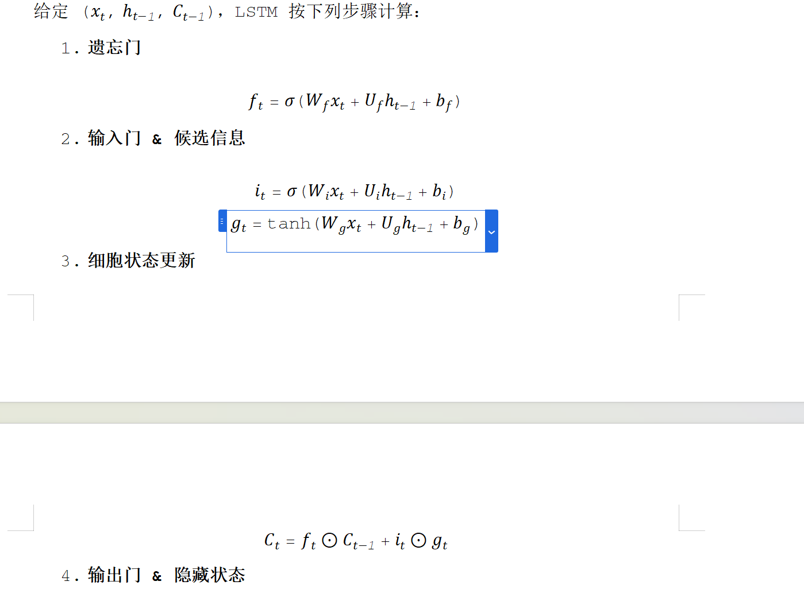

# Markdown转Word转换器(支持数学公式)

一个功能强大的工具，可以将包含LaTeX数学公式的Markdown文档转换为Word文档，同时保持公式的可编辑性。非常适合学术写作、技术文档和科学论文。

## ✨ 主要特性

- ✅ 完整支持Markdown语法（标题、段落、列表、表格）
- ✅ LaTeX数学公式转换（行内和块级）
- ✅ 代码块和行内代码支持（带语法高亮）
- ✅ 文档格式和样式保持
- ✅ Word中的公式可编辑（使用Word的公式编辑器）
- ✅ 支持希腊字母和数学符号
- ✅ 支持复杂数学表达式
- ✅ 网页界面，支持实时预览
- ✅ 拖拽文件上传
- ✅ 多种转换模式（基于Pandoc和原生模式）

## 🎨 效果展示

### 代码插入效果

1. 实时预览效果：


2.转换成word文档的数学公式效果：


代码块支持多种编程语言的语法高亮，包括但不限于：Python、JavaScript、Java、C++、LaTeX等。

## 🚀 安装指南

### 环境要求

- Python 3.7或更高版本
- Microsoft Word 2016或更高版本（获得最佳公式编辑体验）
- 支持Windows、macOS和Linux系统

### 第1步：克隆仓库

```bash
git clone https://github.com/yourusername/markdown-to-word-converter.git
cd markdown-to-word-converter
```

### 第2步：配置Python环境

推荐使用虚拟环境：

```bash
# 创建虚拟环境
python -m venv venv

# 激活虚拟环境
# Windows系统:
venv\Scripts\activate
# macOS/Linux系统:
source venv/bin/activate
```

### 第3步：安装Python依赖

```bash
# 使用requirements.txt安装
pip install -r requirements.txt

# 如果遇到网络问题，可以使用国内镜像：
pip install -i https://pypi.tuna.tsinghua.edu.cn/simple -r requirements.txt
```

需要安装的Python包：
- python-docx：Word文档处理
- markdown：Markdown解析
- beautifulsoup4：HTML解析
- sympy：数学符号处理
- lxml：XML处理
- Pygments：代码高亮
- Flask：Web服务器
- Flask-CORS：跨域支持

### 第4步：安装Pandoc（推荐）

推荐安装Pandoc以获得最佳的数学公式转换效果：

**Windows系统：**
- 方式1：运行包含的`install_pandoc.bat`脚本
- 方式2：从[Pandoc官网](https://pandoc.org/installing.html)下载安装包手动安装

**macOS系统：**
```bash
brew install pandoc
```

**Linux系统（Ubuntu/Debian）：**
```bash
sudo apt-get update
sudo apt-get install pandoc
```

验证Pandoc安装：
```bash
pandoc --version
```

## 💻 使用指南

### 方式1：网页界面（推荐）

1. 启动Web服务器：
```bash
# 方式1：使用Python
python app.py

# 方式2：使用批处理文件（Windows）
start_server.bat
```

2. 打开浏览器访问：http://localhost:5000

3. 网页界面功能：
   - 左侧面板：Markdown编辑器，支持实时预览
   - 右侧面板：转换结果预览区
   - 支持拖拽文件上传
   - 一键转换并下载Word文档
   - 支持数学公式和代码块

### 方式2：命令行界面

**使用数学公式转换器（推荐）：**
```bash
python word_math_converter.py 输入文件.md [输出文件.docx]
```

**使用基础转换器：**
```bash
python enhanced_converter.py 输入文件.md [输出文件.docx]
```

### 方式3：Python API集成

```python
from enhanced_converter import EnhancedMarkdownToWordConverter

# 创建转换器实例
converter = EnhancedMarkdownToWordConverter()

# 转换文件
output_file = converter.convert_file('输入文件.md', '输出文件.docx')
print(f"转换完成：{output_file}")
```

## 📝 支持的数学公式语法

### 行内公式
使用单个美元符号：`$E = mc^2$`

### 块级公式
使用双美元符号：
```
$$\int_{-\infty}^{\infty} e^{-x^2} dx = \sqrt{\pi}$$
```

### 常用LaTeX命令

| LaTeX命令 | 显示效果 | 说明 |
|-----------|---------|------|
| `\frac{a}{b}` | (a)/(b) | 分数 |
| `\sqrt{x}` | √(x) | 平方根 |
| `\sum` | ∑ | 求和 |
| `\int` | ∫ | 积分 |
| `\alpha` | α | 希腊字母alpha |
| `\beta` | β | 希腊字母beta |
| `\pi` | π | 圆周率π |
| `\infty` | ∞ | 无穷符号 |
| `\leq` | ≤ | 小于等于 |
| `\geq` | ≥ | 大于等于 |
| `\neq` | ≠ | 不等于 |
| `\approx` | ≈ | 约等于 |

## 🔧 常见问题解决

### 常见问题及解决方案

1. **公式显示问题**
   - 检查LaTeX语法是否正确
   - 使用支持的LaTeX命令
   - 如需要可以简化复杂公式
   - 确保安装了数学字体（Times New Roman、Cambria Math）

2. **字符编码问题**
   - 使用UTF-8编码保存文件
   - 检查系统字体支持
   - 使用兼容的文本编辑器

3. **依赖安装失败**
   - 尝试使用国内Python包镜像
   - 验证Python版本兼容性（≥3.7）
   - 检查系统架构兼容性

4. **Pandoc相关问题**
   - 验证Pandoc安装（`pandoc --version`）
   - 检查系统PATH配置
   - 尝试重新安装Pandoc

## 📁 项目结构

```
markdown-to-word/
├── app.py                  # Web服务器实现
├── llm_vision_ocr.py      # OCR支持模块
├── pandoc_converter.py     # 基于Pandoc的转换器
├── pandoc_math_converter.py # 增强型数学公式转换器
├── simple_effective_converter.py # 基础转换器
├── requirements.txt        # Python依赖
├── start_server.bat       # Windows启动脚本
├── static/                # Web资源文件
├── templates/             # HTML模板
├── uploads/              # 上传目录
└── temp/                 # 临时文件目录
```

## 🤝 参与贡献

欢迎提交Pull Request来改进这个项目！

1. Fork本仓库
2. 创建你的特性分支 (`git checkout -b feature/AmazingFeature`)
3. 提交你的改动 (`git commit -m '添加某个特性'`)
4. 推送到分支 (`git push origin feature/AmazingFeature`)
5. 创建一个Pull Request

## 📄 开源协议

本项目采用MIT协议开源 - 详见 [LICENSE](LICENSE) 文件

## 🙏 致谢

- [Pandoc](https://pandoc.org/) - 文档转换引擎
- [python-docx](https://python-docx.readthedocs.io/) - Word文档处理
- [Flask](https://flask.palletsprojects.com/) - Web界面框架

## 📬 联系方式

如果你有任何问题或建议，请在GitHub上创建Issue。
